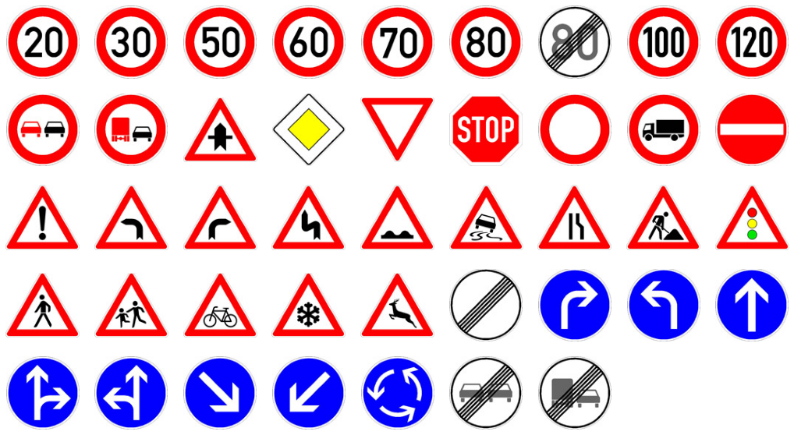

# Identifying and Classifying Street Signs

## Problem Statement

Self-driving cars are the way of the future, from personal use, deliveries, shipping and more. Here at WAVE (Washington Automated Vehicle Enterprise) we are looking to break into the market for self-driving cars and want to test car capabilities in identifying different types of street signs, and the information contained on them. 

## Datasets

We use datasets from the German Institut Für Neutoinformatik at Ruhr-Universität Bochum which has one set (German Traffic Sign Recognition Benchmark, GTSRB) for street sign classification comprised of ~52000 images, which are derived from tracks (series of 30 photos) of the same sign, resulting in varying image sizes for the same sign. The images range from 15x15 to 250x250 pixels in size and there are 43 different signs, which can be generally classified into prohibitory, mandatory, danger, and other. Included are CSVs outlining the file name, image size, bounding box for the sign, and the class. The dataset is pre seperated into training and test splits, with 75% to 25% proportion respectively. The signs are shown here:

The second set of data (German Traffic Sign Detection Benchmark, GTSDB) uses full images (1360x800) with the goal of identifying and classifying the signs within them. The images can contain one, multiple, or no signs at all, and are of varying clarity and contrast. Sign distances within the image are also not fixed. The training set is the first 600 images, and the test set is the last 300 images. Included is a CSV with each row being representation of a single sign as the file it is from, the coordinates of the bounding box, and the class id for the sign. 

## Executive Summary

The ultimate goal of identifying and classifying signs within a larger image was broken into two parts. Use of a basic CNN and a Mask RCNN was used to tackle the challenge. When trying to classify signs using the GTSRB set alone, a CNN vastly outperformed the Mask RCNN, while the CNN would not be easily implemented on the GTSDB dataset. To accomplish the ultimate goal, a pipeline was made where a CNN was trained for the GTSRB dataset, Mask RCNN was used to identify and extract signs from teh GTSDB dataset, and thoes extracted signs were fed back into the trained net from the GTSRB. 

[Download data and initial EDA](code/DATA_and_EDA.ipynb)

[Image Modification](code/Image_modification.ipynb)

### GTSRB CNN

For the CNN in the GTSRB dataset, many different configurations were tried, with varying number of layers, CNN filters, the filter kernel size, and dropout. Since the signs typically come from a track of images, and the images are eventually resized, the biggest improvement to the model was having a fairly large dropout percentage. Going from no dropout made the model go from ~90% accuracy to ~97% accuracy. The final net configuration was:
 - Image Size: 40x40 pixels
 - CNN layers: 3
 - CNN filters: 256 each
 - kernel size: 5
 - Pooling size: (2,2)
 - dense layers: 1
 - dense layer size: 128
 - drop out percentage: 40%
 - batch size: 512

[GTSRB CNN training](code/GTSRB_CNN.ipynb)

### GTSRB Mask RCNN

To see the classification capability of Mask RCNN, and potentially use the result as a base for the DTSDB dataset. The base parameters just use the COCO parameters which is the set commonly known for Mask RCNN. The results were less than ideal, and performance wasn't calculated due to how poorly it was performing. 

[GTSRB Mask RCNN attempt](code/GSTRB_Mask_RCNN.ipynb)

### GTSDB Mask RCNN

In order to get traffic sign recognition, a few attempts were made with image manipulation and sign class IDs. At base with no manipulation and the full sign set, as expected from the results of the previous section, the Mask RCNN did not perform well at differentiating the signs themselves, but did well to pick up sign locations with base performance at ~85%. To extract masks, the minimum confidence in sign recognition was set to 0.1 Normalizing the image contrast and brightness helps with the sign identification a little bit when using all sign categories, and also greatly reduces the odds of finding an extra box. The biggest improvement, since classification isn't performed here, was to just classify off of general sign shape and color (red circle, red triangle up, red triangle down, blue circle, etc). This significantly improved the performance for identification, making the final outcome 93% effective at properly identifying signs. 

[GTSDB Mask RCNN training](code/GTSDB_Mask_RCNN_train.ipynb)

### GTSDB Masks into GTSRB CNN

Additional images were created in order to make a background classification for this set of the net. Mask RCNN could potentially return a false mask, so a background class was made to try and remove these extra masks. To construct a background class, 3000 (2250 train, 750 test) subimages were extracted from the training set of GTSDB, with the requirement that subimages did not overlap with sign bounding boxes. 

To account for overlapping boxes, if the IoU of two masks was greater than 0.4, the average of boundaries would be taken to obtain a single mask. Depending on the image and label configuration, the amount of false boxes in an image ranges from ~0.5~1.3 extra masks per image. The best setups (maximizing total accuracy or reducing extra boxes) when input to the CNN returns 0.25-0.50 extra boxes not seen as background per image. 

Subimages were extracted from the full image using the calculated masks, with extra padding added to account for the basic padding in the GTSRB dataset (10% with a min of 5 pixels is what is stated for the dataset). A few types of padding were tried (flat values, using 10% metric, none), with a flat addition of 7 performing the best. 

Ultimately, the best performing combination for everything was no image normaliztion on either set and using sign subcategories to make the masks. When not using sign subcategories, the pipeline preferred image normalization on the GTSDB Mask RCNN but not for the GTSRB CNN due to its ability to significantly reduce false bounding boxes. 

The final model has a 93% sign identification rate (finds signs it was supposed to), a 98.8% classification rate of those signs found, for 92% true sign recognition (correctly found the sign and properly classified it among 43 sign types) with a 0.5 false signs per image rate.  

[Evaluate GTSDB extracted signs with GTSRB trained CNN](code/Evaluate_GTSDB.ipynb)

## Conclusions and Recommendations

Using the pipeline for CNN to Mask RCNN back to CNN works well at not only identifying signs, but also properly classifying them as well. With a 92% total success rate, we have shown great performnace at full identification and classification. The false recognition rate is also relatively low, at between 0.25-0.5 false sign recognitions per image. Expanding this to a more continuous dataset can be used to enhance results, as some of the false postitives were multiple factors coming into play. 

In order to improve performance, including growing some of the common background issues (other common signs, back of signs, stop lights, etc) would further reduce the false sign recognition. Improving image quality in terms of brightness and contrast, especially at the point of acquisition would also help improve results. 

## Sources
 - [GTSRB/GTSDB](https://benchmark.ini.rub.de/index.html)
 - Mask RCNN
    - [arXiv](https://arxiv.org/abs/1703.06870)
    - [Original Github](https://github.com/matterport/Mask_RCNN)
    - [Used Github for TensorFlow 2.x version fixes] (https://github.com/ahmedfgad/Mask-RCNN-TF2)
    - [Tutorial] (https://machinelearningmastery.com/how-to-train-an-object-detection-model-with-keras/)

